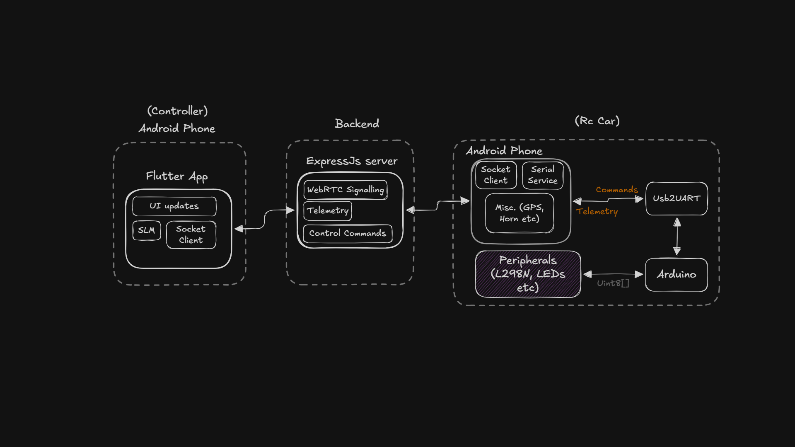

# Project RC Car

A Flutter, Node.js, and Arduino workspace for controlling an RC car from a mobile dashboard. The system has three main runtime pieces:

- **Controller mobile app**: Flutter app used by the driver to steer, throttle, switch lights, send direct actions, view telemetry, and receive the video stream.
- **Bridge app (`flutterino`)**: Flutter app that runs near the car, connects to the relay server, communicates with the Arduino over USB serial, sends telemetry back, and handles WebRTC/video-related events.
- **Relay backend**: Node.js Socket.IO server that connects one controller and one bridge, relays control packets, telemetry, direct actions, camera switch requests, and WebRTC signaling.

## Architecture



At a high level, the controller app emits command buffers over Socket.IO to the relay backend. The bridge app receives those buffers, forwards them to the Arduino over serial, and sends telemetry frames back through the same relay. The backend also forwards WebRTC signaling messages between the controller and bridge.

## Repository Layout

```text
apps/
  arduino/rc_car/          Arduino sketch for the RC car hardware
  backend/                 Socket.IO relay server
  controller_mobile_app/   Flutter controller/dashboard app
  flutterino/              Flutter bridge app for car-side serial + video
misc/
  architecture.png         System architecture diagram
  goals.png                Project goals image
melos.yaml                 Flutter/Dart workspace configuration
package.json               Node.js dependency manifest
pnpm-workspace.yaml        pnpm workspace configuration
pubspec.yaml               Root Dart/Melos manifest
```

## Prerequisites

- Flutter SDK with Dart 3.x
- Node.js and pnpm
- Arduino IDE or Arduino CLI
- An Arduino-compatible board connected to the RC car electronics
- A network where the controller app and bridge app can both reach the backend server

## Setup

Install Node dependencies:

```bash
pnpm install
```

Install Flutter/Dart dependencies for the workspace:

```bash
dart pub get
dart run melos bootstrap
```

If Melos is not available through the local Dart tooling, install it globally:

```bash
dart pub global activate melos
melos bootstrap
```

## Running The Backend

From the repository root:

```bash
node apps/backend/index.js
```

The backend listens on port `3000` by default. You can override it with `PORT`:

```bash
PORT=4000 node apps/backend/index.js
```

Health check:

```bash
curl http://localhost:3000
```

The response reports whether the bridge and controller are connected.

## Running The Controller App

The controller app is in `apps/controller_mobile_app`.

Create `apps/controller_mobile_app/.env` with the backend URL:

```env
API_URL=http://192.168.10.159:3000
```

Then run:

```bash
cd apps/controller_mobile_app
flutter pub get
flutter run
```

The app also exposes an in-app Socket API URL setting, so the backend address can be changed without rebuilding.

## Running The Bridge App

The bridge app is in `apps/flutterino`. It runs on the device attached to the Arduino over USB serial.

```bash
cd apps/flutterino
flutter pub get
flutter run
```

The current default server URL is defined in `apps/flutterino/lib/main.dart` as `kServerUrl`, and the app includes a UI field for updating the Socket.IO server URL at runtime.

## Arduino Firmware

The Arduino sketch is located at:

```text
apps/arduino/rc_car/rc_car.ino
```

Upload it to the Arduino board using the Arduino IDE or Arduino CLI. The sketch:

- Reads framed command buffers from serial at `115200` baud.
- Drives steering, motor direction, PWM motor enable, headlights, fog lights, indicators, brake lights, and reverse lights.
- Measures battery voltage and RPM/speed telemetry.
- Sends telemetry frames back over serial.

## Socket Events

The backend recognizes two roles:

- `controller`: the driver app.
- `bridge`: the car-side Flutter app.

Main events:

- `register`: identifies a client as `controller` or `bridge`.
- `cmd`: controller-to-bridge Arduino command buffer.
- `direct`: controller-to-bridge direct action payloads, such as horn control.
- `camera-switch`: controller-to-bridge camera switch request.
- `telem`: bridge-to-controller telemetry buffer.
- `signal`: WebRTC signaling relay between controller and bridge.
- `peer-joined` / `peer-disconnected`: connection status notifications.

## Development Notes

- This project was built as a fast-moving prototype, with many features explored and implemented through "on the go" iteration and heavy AI-assisted development. As a result, some parts of the codebase intentionally favor speed of experimentation over long-term architectural polish.
- The current implementation may have higher coupling, raw/shared state management, and less strict adherence to MVVM-style separation than a production codebase should have. These tradeoffs helped validate the end-to-end RC car control flow quickly, and they also make the next engineering improvements clear: stronger module boundaries, cleaner state management, more explicit view-model layers, and broader automated test coverage.
- Command packets and telemetry parsing are implemented in the Flutter services under each app's `lib/services` directory.
- The controller sends command buffers on a short periodic loop for responsive control.
- The bridge forwards incoming command buffers to the Arduino and publishes telemetry back to the controller.
- Keep the backend address consistent across both Flutter apps when testing on real devices.
